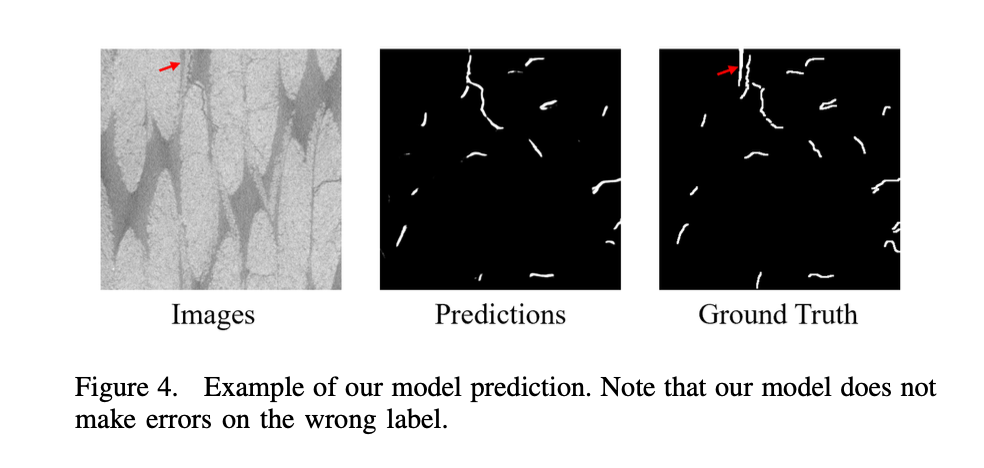
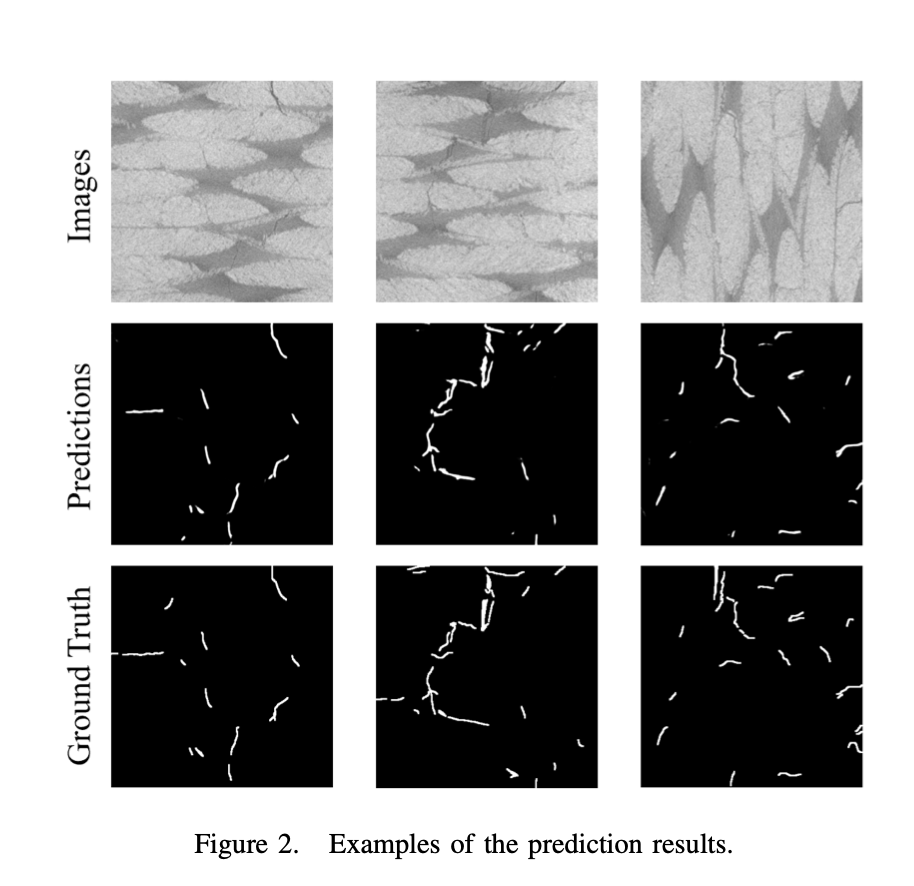
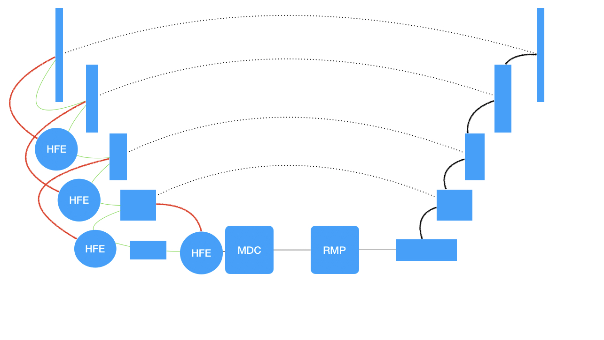
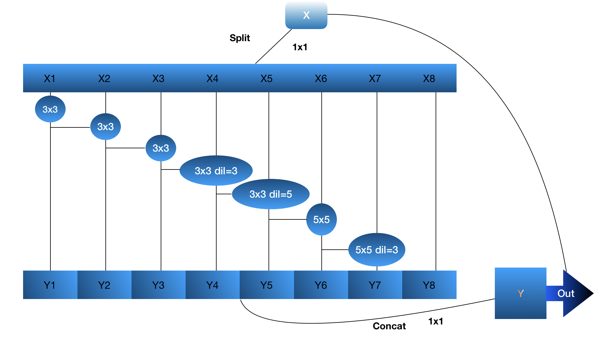
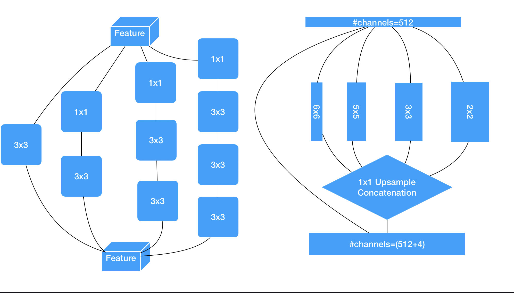
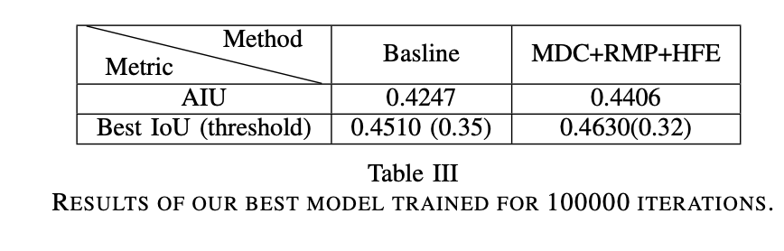
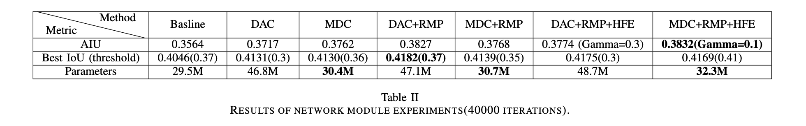

# Crack Segmentation on FRP CT Images Using Residual Multi-scale Dilated Convolution and Reversed Cross Entropy Loss
## Example Prediction


## Dependencies
Use 
  * ```$cd Root```
  * ```$pip install -r requirements.txt```
  To install the enviroment settings
## Usage

1. Clone the repository

2. Download [our data](https://drive.google.com/file/d/1kUyFRiH3qdc8NEEM4iM-_sPc9obowL1U/view?usp=share_link)
Unzip the file and put it under <./datasets/FRP/>


3. Experiment running:
   ```shell
   python train.py --config_file <CONFIG FILE>
   ```
Different scripts in <./scripts/>
- run_sce_exp.sh: Run the Symmetric Cross-entropy loss experiments.
- run_model_exp.sh: Run the network architecture experiments.
- run_HFE_\*.sh: Run the ablation study of HFE module.
- run_final.sh: Run all the 100000-epoch experiments. Best result achieved using config_MSC_RMP_HFE_0.1_final.yaml.
- test.sh: Run a sample test on the baseline. 

4. Test:
   ```shell
   python test.py output/<OUTPUT DIRECTORY (OUTPUT_DIR at config.yaml)> <iteration number> 
   ```
# ml-project-2-cracksegfrp
## Introduction:
This paper aims at solving the crack segmentation task on fiber-based plastic (FRP) CT images. After manually collecting the images and doing the labeling, we adopt a SOTA method on benchmark crack segmentation datasets as our baseline methods. Then we propose various modifications to improve the performance, including a loss function for robust classification, network modules aiming at dealing with cracks with different shapes and retaining high-frequency components in the images. We also propose a new architecture, Multi- scale Dilated Convolution (MDC), that can capture multi- shaped cracks with less parameters than existing methods. Our results show that the modifications boost the performance of the baseline method.
## Network Architecture

The overall architecture of the modified UNet model. Red(green) lines represent the tensor from the shallower(deeper) layer in the down- sampling parts, and the black lines stand for the up-sampling parts. The dotted lines are the skip connections in UNet
## Important Modules
### MDC

The graphical illustration of Multi-scale Dilated Convolution by Splitting Channels. The input feature map is fed into a 1x1 convolution, and the channels are split into 8 subsets. Cascade convolutions with kernels of multiple sizes and dilation rates are used for each subset. Then all the subsets are concatenated and fed into a 1x1 convolution, and finally stacked with the input map.
### DAC RMP

The graphical representation of DAC(left) and RMP(right). The DAC uses four cascade pipelines of convolutions with different sizes, which can enlarge the receptive field to extract more information. The RMP feds the input feature map into four convolutions of sizes 2, 3, 5, and 6, then the resulting feature map is upsampled to the height and weight size as the input to combine the extracted information with the input map.
## Results


